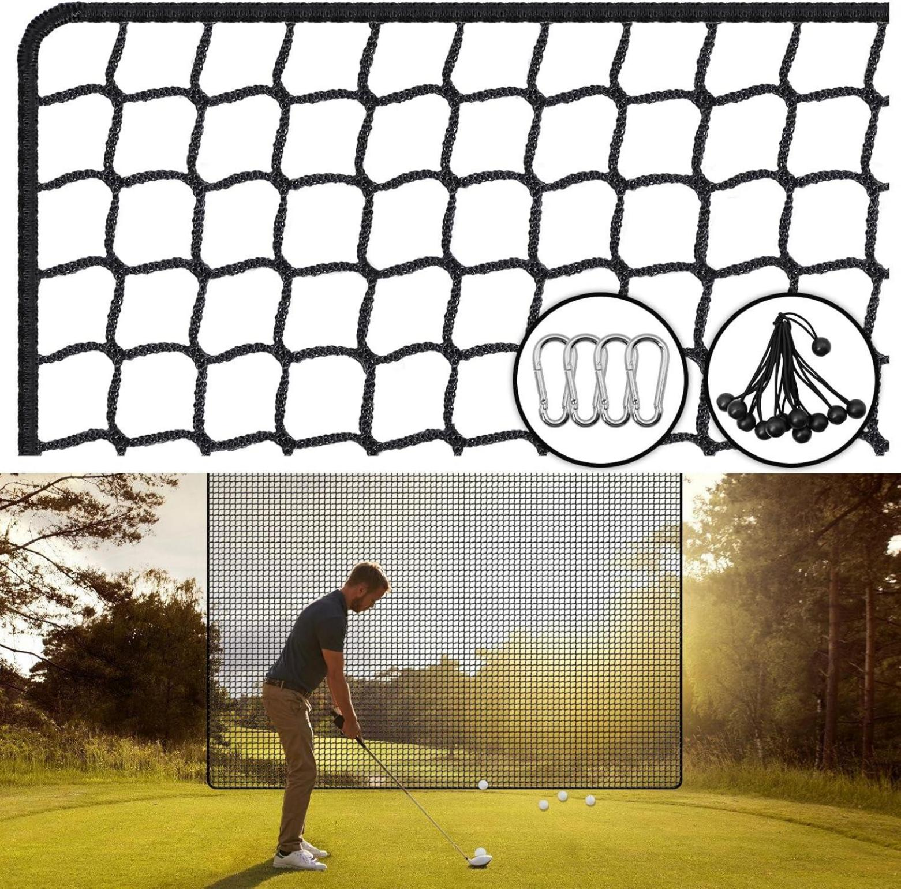
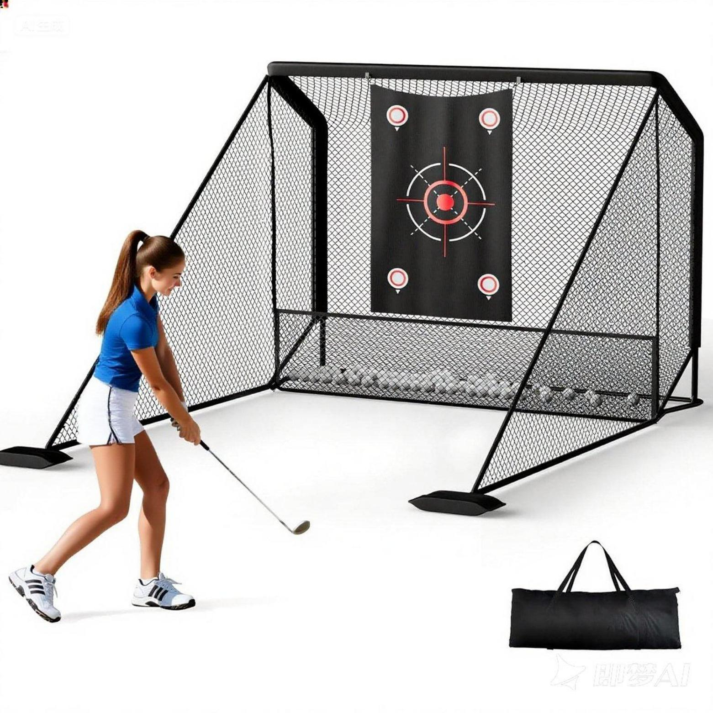

GN001

10 x 7ft Golf Net for Hitting, Chipping, Driving Training, Heavy Duty Golf

Practice Net for Indoor, Backyard, Garage, with Mat, Target Cloth, 8  Tees, 6 Balls, Carry Bag

ON001

Golf Practice Net, Golf Hitting Nets Heavy Duty Nylon Golf Netting for  Garage Backyard

1. Size: 10x15ft

2. Net: 5 ply 1'' polyester net

3. NW2.5kg

4.Carton size:6sets in a carton size 36x18x17cm GW 15.35kg

GN-015

Golf Practice Net, 10x7ft Heavy Duty Golfnets for Indoor/Outdoor Training, Portable Hitting Nets with Carry Bag, Ideal Golfs Training Aid for Golfers

Backyard Driving Chipping Swing

GN-016

Range Cage 10 x 8 ft Golf Practice

Hitting Net - Choose Between Printed Graphics Impact Screen, Blank

Simulator Screen, or Classic Net

